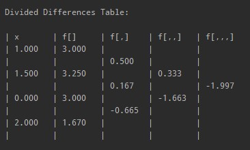

# Polynomial Interpolation
Print Newton's Divided Differences Table. <br />
Print the unsimplified and simplified polynomial in Newton's form and Lagrange's form.

### To run file on command line / terminal:
```
java -jar "filepath/../Polynomial Interpolation.jar"
```
For input file with nodes > 8, I recommend running the program on an IDE because 
depending on your screen size, the divided differences table may get too wide
and columns will overlap on the command line.

### Sample Output for input.txt

```
--------------------------------------------------------------------------------------------------

Newton's Unsimplified Polynomial: 
3.000 + 0.500(x - 1.0) + 0.333(x - 1.0)(x - 1.5) - 1.997(x - 1.0)(x - 1.5)(x)

Newton's Simplified Polynomial:
-1.997x^3 + 5.325x^2 - 3.328x + 3.000

--------------------------------------------------------------------------------------------------

Lagrange's Unsimplified Polynomial:
3.00 * ((x - 1.5)(x)(x - 2.0) / (1.0 - 1.5)(1.0)(1.0 - 2.0))
+ 3.25 * ((x - 1.0)(x)(x - 2.0) / (1.5 - 1.0)(1.5)(1.5 - 2.0))
+ 3.00 * ((x - 1.0)(x - 1.5)(x - 2.0) / (0.0 - 1.0)(0.0 - 1.5)(0.0 - 2.0))
+ 1.67 * ((x - 1.0)(x - 1.5)(x) / (2.0 - 1.0)(2.0 - 1.5)(2.0))

Lagrange's Simplified Polynomial:
-1.997x^3 + 5.325x^2 - 3.328x + 3.000

--------------------------------------------------------------------------------------------------
```
